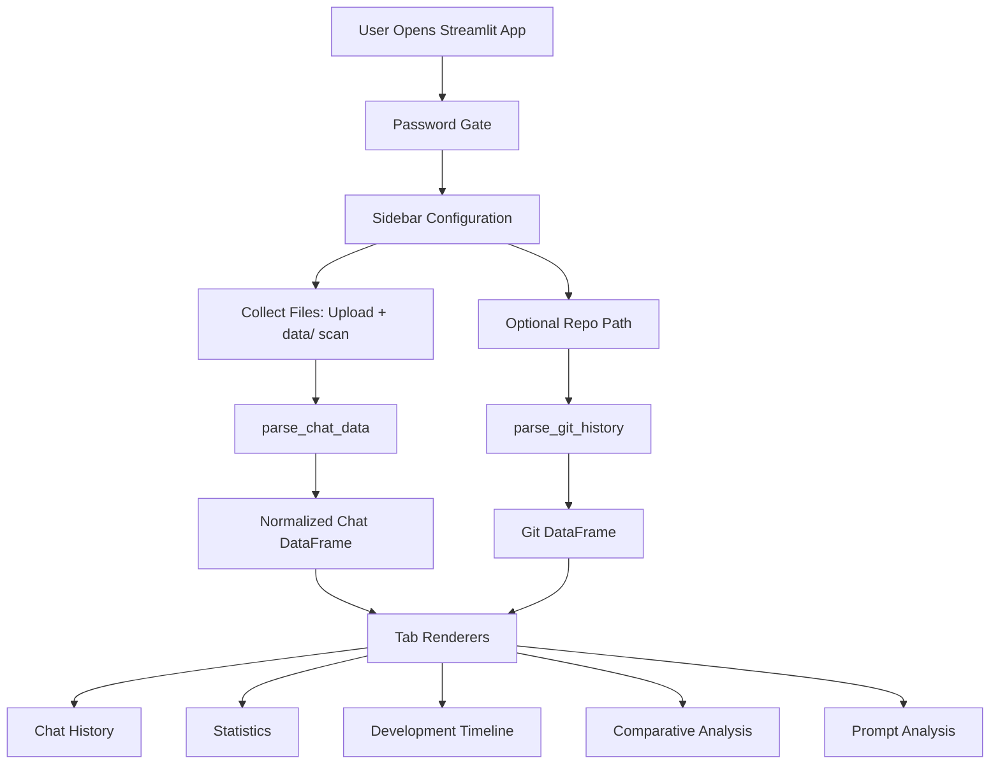

# Developer Guide Addendum

## 1. Purpose

This addendum explains how to run, maintain, and extend Copilot History Analyzer.

## 2. Tech Stack

- Python 3.10+
- Streamlit
- pandas
- Plotly
- GitPython

## 3. System Architecture

### 3.1 Module Responsibilities

| Module                      | Responsibility                                                        |
| --------------------------- | --------------------------------------------------------------------- |
| app.py                      | App entrypoint, sidebar controls, orchestration, tab wiring           |
| services/auth.py            | Password gate using Streamlit secrets or APP_PASSWORD env var         |
| services/data_processing.py | Discover files, parse chat JSON, normalize records, parse git history |
| services/analytics.py       | Reusable metrics and prompt-style analysis functions                  |
| views/tabs.py               | Rendering logic for all Streamlit tabs                                |

## 4. Data Contract (Summary)

Each chat JSON should include a top-level requests array.

Key parsed fields:

- timestamp
- message.text
- response[]
- result.details
- result.usage.promptTokens
- result.usage.completionTokens
- result.timings.totalElapsed
- result.timings.firstProgress
- variableData.variables[].value.path or fsPath
- editedFileEvents

Primary output columns from parse_chat_data:

- timestamp
- user_text
- assistant_text
- model
- completion_tokens
- prompt_tokens
- code_lines_suggested
- file_name
- suspected_user
- latency_ms
- ttft_ms
- referenced_files
- languages
- phase
- source_path
- edited_file_events
- checkpoints_restored

Primary output columns from parse_git_history:

- timestamp
- author
- message
- insertions
- deletions
- files

## 5. Setup and Run

1. Create venv: python -m venv .venv
2. Activate (PowerShell): .\.venv\Scripts\Activate.ps1
3. Install deps: pip install -r requirements.txt
4. Set password:
   - Env var: $env:APP_PASSWORD = "your-password"
   - Or .streamlit/secrets.toml: APP_PASSWORD = "your-password"
5. Run app: streamlit run app.py

## 6. Extension Workflow

- New metric: add logic to services/analytics.py, then render in views/tabs.py.
- New tab: add renderer in views/tabs.py and wire it in app.py.
- New input source: extend services/data_processing.py and keep schema compatibility.

## 7. QA Checklist

- App starts and reaches sign-in prompt
- Sign-in succeeds with configured password
- Upload mode parses a valid chat JSON
- Phase selection mode discovers JSON files under data/
- Statistics tab renders without exceptions
- Timeline tab renders with chat-only data
- Timeline tab renders with chat+git data
- Comparative tab works with at least two phases
- Prompt analysis table and charts populate correctly

## 8. Security and Privacy

- Password is required to access the application UI.
- Do not commit real credentials in repository files.
- Keep exported chat data anonymized when sharing externally.

## 9. Known Limitations

- Success and error rates are heuristic-based, not ground-truth correctness.
- Git insertion counts are a volume proxy, not authorship proof.
- Parsing logic assumes the chat export contains expected request fields.

## 10. Future Improvements

- Add automated tests for services layer parsing and analytics logic.
- Add export-to-CSV/JSON for per-tab outputs.
- Add richer schema validation and parse diagnostics.
- Add user role levels beyond single password gating.

## 11. Handoff Package

- This guide and User Guide addendum
- Sample valid chat JSON files
- A sample repository path for git correlation testing
- A known-good APP_PASSWORD setup method for local run
